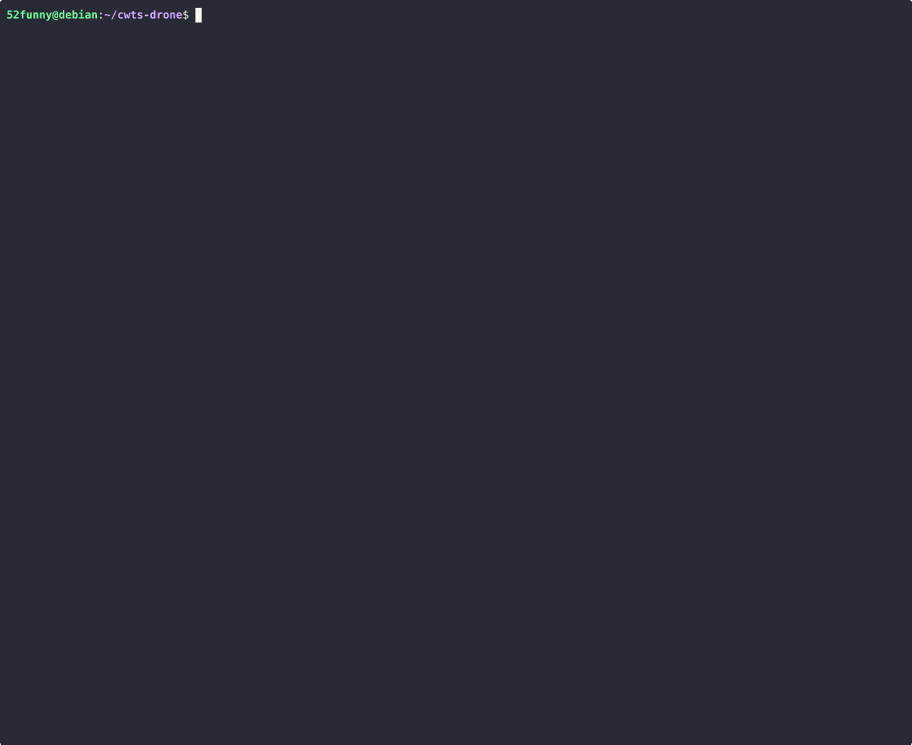

# Compact and Weighted Threshold Signature Scheme for Verifiable Drone Swarm Messaging


This project provides a **Golang** implementation for handling weighted threshold signature schemes in heterogeneous drone swarms.




## Key Features

- **Multi-weight Support**: Supports heterogeneous drone nodes with a weight-based threshold signature mechanism.
- **Efficient Signature Aggregation**: Implements efficient signature collection and verification through the aggregator module.
- **Modular Design**: Offers a clear code structure, making it easy to extend and customize.
- **Benchmark Testing**: Allows adjustment of swarm size and threshold parameters to analyze performance.

## Installation and Execution

### Prerequisites

- **Golang** (Recommended version >= 1.23)
- **GMP Library** (GNU Multiple Precision Arithmetic Library)

### Installation Steps

1. Clone the repository to your local environment:

   ```bash
   git clone https://github.com/52funny/cwts-drone
   cd cwts-drone
   ```

2. Build the project using `make`:
   ```bash
   make
   ```

## Usage Instructions

### Running Benchmark Tests

You can adjust the total number of drones and the threshold value for signature participation using the following command:

```bash
go test -bench Benchmark -run=$^ -num=256 -threshold=32
```

Parameter descriptions:

- `-num`: Total number of drones (default: 50).
- `-threshold`: Number of drones required to participate in the signature (default: 20).

## Directory Structure

Below is an overview of the main directories and files in the project:

```
├── Makefile                # Build and clean commands
├── README.md               # Project documentation
├── cmd/                    # Main program entry and CLI tools
│   ├── aggregate/          # Aggregator module
│   │   ├── aggregate.go    # Signature aggregation implementation
│   │   ├── hub.go          # Aggregator communication hub
│   │   └── store.go        # Data storage implementation
│   ├── main.go             # Main program entry
│   ├── ta/                 # Trusted Authority module
│   │   └── ta.go           # Trusted Authority implementation
│   ├── tools/              # Tools module
│   │   └── launch.go       # Launch tool
│   └── uav/                # Drone module
│       └── uav.go          # Drone logic implementation
├── crt.go                  # Chinese Remainder Theorem implementation
├── crt_test.go             # CRT module tests
├── go.mod                  # Go module dependencies
├── go.sum                  # Go module checksums
├── signer.go               # Signature implementation
├── utils.go                # Utility functions
└── utils_test.go           # Utility function tests
```

## Contribution Guidelines

We welcome contributions from the community! Please follow the steps below:

1. Fork the repository to your personal account.
2. Create a feature branch:
   ```bash
   git checkout -b feature/your-feature-name
   ```
3. Commit your code and create a Pull Request.

## Acknowledgements

This project makes use of the following open-source libraries and tools:

- [GNU MP Library (GMP)](https://gmplib.org/): Provides efficient multiple-precision arithmetic operations.
- [GMP Golang Wrapper](https://github.com/ncw/gmp): A Go wrapper for the GNU MP Library (GMP)
- [Cloudflare CIRCL](https://github.com/cloudflare/circl): A cryptographic library for high-performance elliptic curve operations.
- [Google UUID](https://github.com/google/uuid): For generating and handling UUIDs.
- [Gorilla WebSocket](https://github.com/gorilla/websocket): Implements WebSocket protocol for real-time communication.
- [Testify](https://github.com/stretchr/testify): A toolkit for writing unit tests and making assertions.

We deeply appreciate the developers and contributors of these projects for their efforts in advancing the open-source ecosystem.

## Contact Us

If you have any questions or suggestions, feel free to reach out via:

- Project Issue Page: [GitHub Repo Issues](https://github.com/52funny/cwts-drone/issues)
